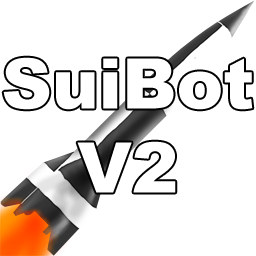

# SuiBot-V2

SuiBot-V2 is a successor to [SuiBot_Console](https://github.com/SuiMachine/SuiBot_Console) written pretty much entirely from scratch, using many elements that I have learnt over the years. It can run on both Windows and Linux (including Raspberry Pi using mono (only console version tested)). For more informations check out [wiki](https://github.com/SuiMachine/SuiBot-V2/wiki).

Compilation
-------
SuiBot-V2 was written in [Visual Studios Community Edition 2017](https://visualstudio.microsoft.com/). After some minor changes it should compile in 2015 and possibly [Mono Develop](https://www.monodevelop.com/). This is partially due to some inline expressions used that were added 2017 version of Visual Studio.

Credits
-------
  * [SuicideMachine](http://twitch.tv/suicidemachine)
  * Bot uses [SpeedrunComSharp](https://github.com/LiveSplit/SpeedrunComSharp) libary, written by CryZe.
  * Bot uses [SmartIrc4Net](https://github.com/meebey/SmartIrc4net) for its IRC connection.
  
Licence
-------
SuiBot-V2 and its source code are released under LGPL-3.0, with its third party dependency modules using their own licences. See [License file](https://github.com/SuiMachine/SuiBot-V2/blob/master/LICENCE.md).